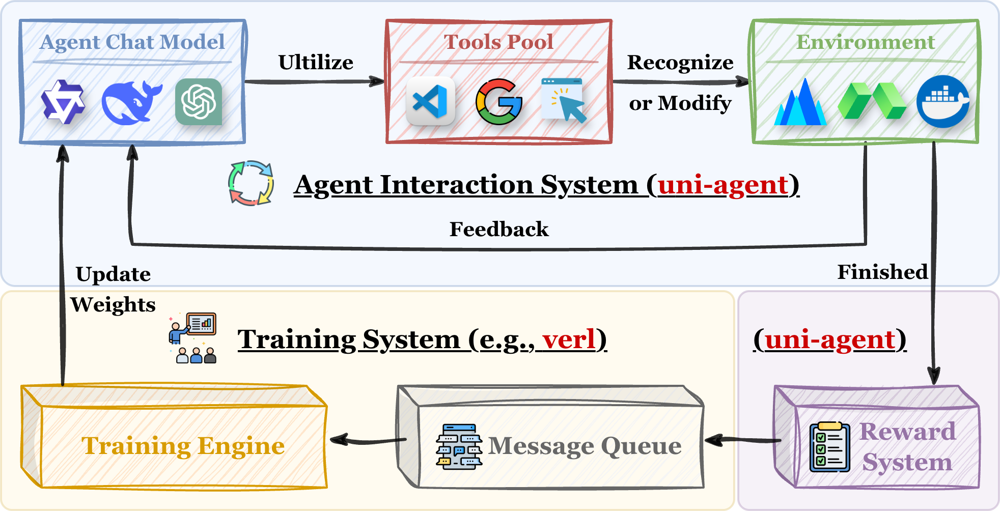

# Uni-Agent: Build, Run, and Train Agents at Scale

[](https://uni-agent.readthedocs.io/en/latest/index.html)
[](./LICENSE)

Uni-Agent is a unified framework for general agents at scale.

- **All-in-one stack:** one framework for building, running, and training agents.
- **Unified agent interface:** unified abstractions for diverse and complex real-world agent scenarios.

The long-term vision is to build the backend infrastructure for next-generation agents across both inference and training, enabling them to perceive, act, and explore complex real-world tasks.

## Highlights ✨

**Unified yet decoupled agent stack:** Uni-Agent organizes agents around `model`, `tool`, and `env`, so each layer can be swapped independently while still composing into one unified interaction framework.

**Large-scale parallel interaction:** Uni-Agent supports high-throughput, stable parallel inference, execution, and verification for 1000+ concurrent agent tasks.

**One stack from inference to training:** Uni-Agent reuses the same interaction stack from large-scale agent execution to RL training, with support for advanced paradigms such as fully-async and partial rollout.

## Quickstart 🚀

Start with the docs below:

- `Launch`: [Launch an agent environment](https://uni-agent.readthedocs.io/en/latest/start/agent_env.html) to run simple demo scripts.
- `Build`: [Build a simple search agent](https://uni-agent.readthedocs.io/en/latest/start/search_agent.html) with minimal customization for arXiv paper search and recommendation.
- `Scale`: [Run parallel agent interaction](https://uni-agent.readthedocs.io/en/latest/start/agent_interaction.html) for large-scale interaction, inference, and verification workloads.
- `Train`: [Train an agent with reinforcement learning](https://uni-agent.readthedocs.io/en/latest/start/agent_train.html) using state-of-the-art training techniques.

## Architecture 🧩



Uni-Agent is built around a unified interaction loop with three parts: `model`, `tool`, and `env`.

- `model` is the reasoning backend that decides what to do next,
- `tool` is how the `model` perceives and acts on the `env`
- `env` is the runtime environment where actions are executed and state is preserved.

This interaction stack is used for large-scale agent execution and can be connected to [verl](https://github.com/verl-project/verl) for scalable RL training.

## Installation 📦

Uni-Agent builds on top of latest `verl` release and can use it as a normal Python package.

```bash
git submodule update --init --recursive
pip install --no-deps -e ./verl

# Other Dependencies
pip install swe-rex loguru pydantic pydantic_settings aiohttp
```

See the full installation guide in the docs: [Installation](https://uni-agent.readthedocs.io/en/latest/start/installation.html).


## Live Dashboard 👀


Uni-Agent includes a lightweight dashboard for monitoring large parallel runs in real time. It is designed for workloads such as parallel inference and reinforcement learning.

Start the dashboard from the repository root:

```bash
python -m dashboard.server --log-dir /tmp/swebench_qwen3_coder --port 8765
```

See [`dashboard/README.md`](./dashboard/README.md) for more details.


## Results 📊

### Parallel Inference & Verification

We compare Uni-Agent with existing agent systems on parallel inference and verification workloads.


| Model            | Benchmark          | OpenHands | Uni-Agent (1-Attempt, Avg@4) |
| ---------------- | ------------------ |:---------:|:----------------------------:|
| Qwen3-Coder-30B  | SWE-Bench-Verified | -         | **48.8**                     |
| Qwen3-Coder-480B | SWE-Bench-Verified | 62.4      | **64.2**                     |
| Qwen3-Coder-Next | SWE-Bench-Verified | 66.6      | **67.7**                     |


### Agent Reinforcement Learning

Uni-Agent supports agent RL training with the same interaction stack used at inference time. A representative recipe is to train [Qwen3-30B-A3B-Instruct](https://huggingface.co/Qwen/Qwen3-30B-A3B-Instruct-2507) on R2E-Gym using **Fully-Asynchronous RL, Partial Rollout, and GSPO**.
Example training scripts are available in [examples/agent_train](examples/agent_train).


| Model                        | Dataset | Train Setup                          | Base | RL       |
| ---------------------------- | ------- | ------------------------------------ |:----:|:--------:|
| Qwen3-30B-A3B-Instruct       | R2E-Gym | GSPO + Fully-Async + Partial Rollout | 22.2 | **36.8** |
| Qwen3-Coder-30B-A3B-Instruct | R2E-Gym | GSPO + Fully-Async + Partial Rollout | 46.2 | **52.0** |


## Roadmap 🗺️

The roadmap below highlights the next major directions for Uni-Agent.

**Environment Support**

- [x] Local deployment support.
- [x] Modal deployment support.
- [ ] More cloud deployment backends.

**Tool and Task Support**

- [ ] GUI tool support.
- [ ] Integration of Skills.
- [ ] More built-in tools and task patterns.

**Model Support**

- [ ] DeepSeek model support.
- [ ] Multimodal model support.

## Citation 📚

If you find the project helpful, please cite:

```
@misc{uniagent_github,
  author       = {Yuyang Ding and Bo Wen and Guangming Sheng and Xibin Wu and Juntao Li and Min Zhang and Uni-Agent Contributors},
  title        = {Uni-Agent: Build, Run, and Train Agents at Scale},
  year         = {2026},
  howpublished = {\url{https://github.com/yyDing1/uni-agent}},
  note         = {GitHub repository. Supervisor: Xibin Wu and Juntao Li},
  urldate      = {2026-03-27}
}
```

## Contributing 🤝

Community contributions are welcome. See [CONTRIBUTING.md](./CONTRIBUTING.md) for guidelines on how to get started.
